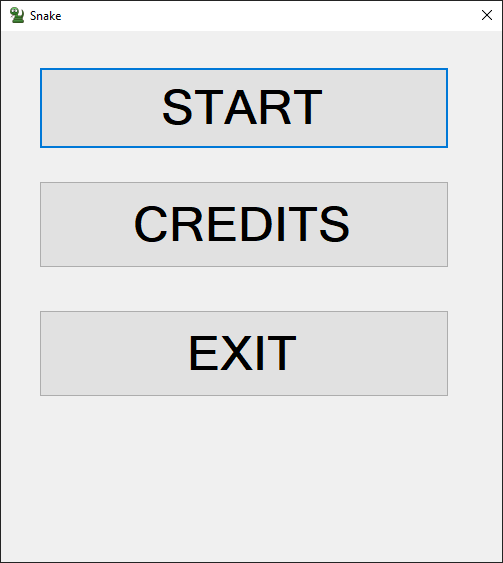
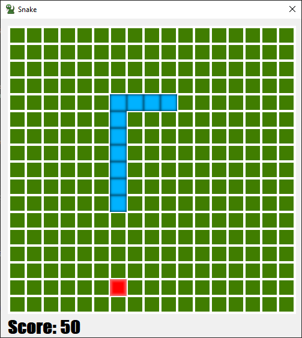

# SnakeGame

## Table of contents
* [General info](#general-info)
* [Technologies](#technologies)
* [Images](#images)

## General info
I did it to learn Windows Forms using .Net.
Snake game is the best game I was playing in childhood so I created it for myself.

## Technologies
Project is created with:
* C#
* Visual Studio 2019
* Windows Forms App

## Images

